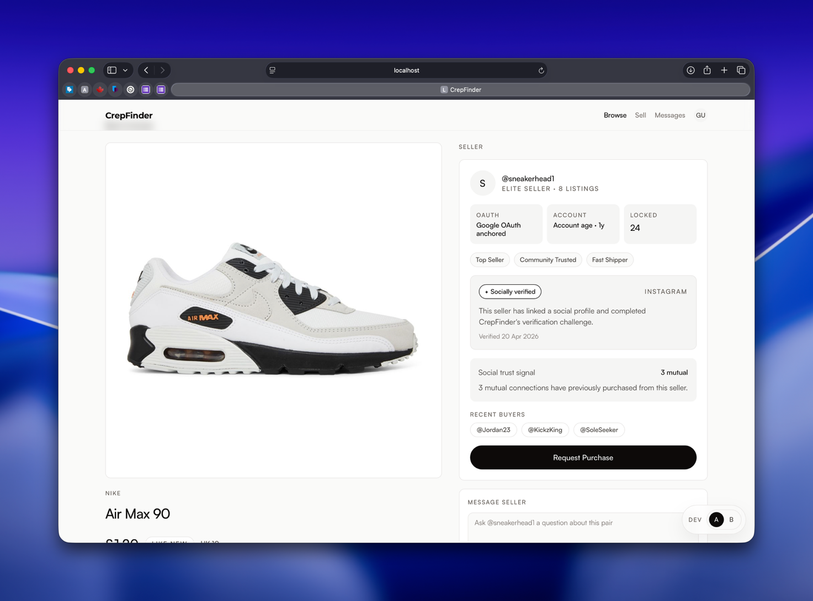
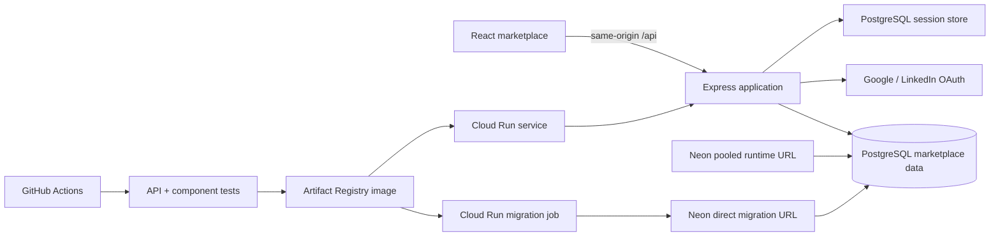

# CrepFinder

CrepFinder is a trust-focused peer-to-peer sneaker marketplace. It supplements conventional ratings with account anchoring, moderated social-profile verification, community cues, and reviews that can only be created after a completed purchase request.

The repository contains a deployment-ready portfolio MVP and the feature-flagged A/B research experience from the original university project.

> **Scope:** CrepFinder currently records purchase intent and order progress. It does not yet process money, issue shipping labels, authenticate sneakers, or pay sellers.

**Live demo:** [crepfinder-4mihrdqh7q-nw.a.run.app](https://crepfinder-4mihrdqh7q-nw.a.run.app/)

The public demo supports marketplace browsing. OAuth sign-in remains disabled until public Google or LinkedIn client credentials are configured.



## Why This Project

Marketplace trust is usually reduced to an average star rating. CrepFinder explores a broader model:

- OAuth-linked accounts establish account provenance.
- Moderated challenge codes link a seller to a public social profile.
- Community cues show previous-buyer relationships.
- Reviews require a completed purchase record.
- Trust cues are presented as evidence, never as guarantees of authenticity or delivery.

## Current Features

- Browse and search active sneaker listings
- Create listings from an authenticated seller account
- Sign in with Google OAuth 2.0 or LinkedIn OpenID Connect
- Start and submit a moderated seller-verification challenge
- Send account-linked buyer messages
- Create purchase requests and apply buyer/seller-specific order transitions
- Restrict reviews to completed purchase records
- Persist marketplace data and production sessions in PostgreSQL
- Run the original consent, balanced random assignment, questionnaire, debrief, and CSV export behind research flags

## Stack

| Layer | Technology |
| --- | --- |
| Frontend | React 18, Wouter 3, Vite 8, Tailwind CSS |
| API | Node.js 24 LTS, Express 4 |
| Data | PostgreSQL with `node-postgres` |
| Authentication | Passport, Google OAuth 2.0, LinkedIn OpenID Connect |
| Security | Helmet, CORS allowlist, rate limiting, HTTP-only sessions |
| Testing | Vitest, Testing Library, Supertest, jest-axe |
| Delivery | Docker, Google Cloud Run, Artifact Registry, GitHub Actions, Dependabot |

## Architecture



The recommended deployment serves the compiled React app and Express API from
one Cloud Run service. That keeps OAuth and session cookies same-origin. A
separate Cloud Run job prepares the schema through Neon's direct endpoint before
the tested image becomes the new application revision.

See [docs/architecture.md](docs/architecture.md) for the product and research boundaries.

## Local Setup

### Prerequisites

- Node.js 24
- npm
- PostgreSQL 16, or Docker Desktop

### Option A: Docker

```bash
docker compose up --build
```

Docker prepares the schema before starting the API.

To add synthetic local demo data:

```bash
docker compose exec backend npm run seed
```

`seed` truncates marketplace tables. Never run it against a database containing real user data.

Open:

- App: `http://localhost:5173`
- API health: `http://localhost:3001/api/health`
- API readiness: `http://localhost:3001/api/ready`

### Option B: Local Node Processes

```bash
cp backend/.env.example backend/.env
cp frontend/.env.example frontend/.env
npm run install:all
```

Start PostgreSQL, then prepare and optionally seed it:

```bash
npm run db:prepare
npm run seed
```

Run these in separate terminals:

```bash
npm run dev --prefix backend
```

```bash
npm run dev --prefix frontend
```

Development mode may show local demo listings when the API is unavailable. Production builds never fall back to mock data unless `VITE_ALLOW_MOCK_DATA=true` is deliberately set.

## Environment

The committed templates contain names only:

- [`.env.example`](.env.example): production deployment template
- [`backend/.env.example`](backend/.env.example): local API template
- [`frontend/.env.example`](frontend/.env.example): local Vite template

Important rules:

- Never commit `.env` files or credentials.
- `SESSION_SECRET` must be a unique random value of at least 32 characters.
- Use a pooled Neon URL for `DATABASE_URL`.
- Use a direct Neon URL for `DATABASE_DIRECT_URL` because schema preparation should not use transaction pooling.
- Keep `ENABLE_RESEARCH_ROUTES=false` in production.
- Keep `VITE_ALLOW_MOCK_DATA=false` in production.
- Only variables prefixed with `VITE_` are included in the browser bundle; never place secrets in them.

Generate independent secrets:

```bash
openssl rand -base64 48
```

## Quality Checks

Run the same checks used by CI:

```bash
npm run check
```

This runs backend tests, frontend tests, and a production frontend build. GitHub Actions also audits production dependencies in both applications and builds the production Docker image.

## Production Deployment

### Recommended: Google Cloud Run + Neon

This path produces one public origin for the UI, API, OAuth callbacks, and cookies.

1. Create a Neon project in the same region as the application. Use its pooled
   URL at runtime and its direct URL for schema preparation.
2. Create a Google Cloud project with billing enabled and select
   `europe-west2` for the London deployment.
3. Create the Artifact Registry repository, runtime identity, deployer identity,
   Secret Manager entries, and repository-restricted Workload Identity provider.
4. Add the five non-secret Google resource identifiers as GitHub repository
   variables.
5. Run **Deploy to Cloud Run** once from GitHub Actions.
6. Confirm:

```text
https://<your-domain>/api/health
https://<your-domain>/api/ready
```

Both endpoints must return HTTP `200`; `/api/ready` must report `"database":"ok"`.

The exact bootstrap commands, IAM grants, secret names, migration job, and
keyless GitHub setup are documented in
[docs/cloud-run.md](docs/cloud-run.md).

The legacy [`railway.json`](railway.json) remains available for a small Railway
deployment, but Cloud Run is the maintained production path.

### Configure Google Sign-In

1. Create a Web application OAuth client in Google Cloud Console.
2. Set the authorised JavaScript origin to:

```text
https://<your-domain>
```

3. Set the authorised redirect URI to:

```text
https://<your-domain>/api/auth/google/callback
```

4. Store the client secret in Google Secret Manager, update the Cloud Run
   service with these variables, and deploy a new revision:

```text
GOOGLE_CLIENT_ID=<client id>
GOOGLE_CLIENT_SECRET=<client secret>
GOOGLE_OAUTH_REDIRECT_URI=https://<your-domain>/api/auth/google/callback
```

Google requires HTTPS and production OAuth apps need an accurate homepage, privacy policy, and terms before broad public use. See [Google OAuth policies](https://developers.google.com/identity/protocols/oauth2/policies).

### Configure LinkedIn Sign-In

1. Create an app in the LinkedIn Developer Portal.
2. Enable OpenID Connect permissions for `openid`, `profile`, and `email`.
3. Add this absolute HTTPS redirect URL:

```text
https://<your-domain>/api/auth/linkedin/callback
```

4. Store the client secret in Google Secret Manager, update the Cloud Run
   service with these variables, and deploy a new revision:

```text
LINKEDIN_CLIENT_ID=<client id>
LINKEDIN_CLIENT_SECRET=<client secret>
LINKEDIN_OAUTH_REDIRECT_URI=https://<your-domain>/api/auth/linkedin/callback
```

See [LinkedIn's authorization-code flow](https://learn.microsoft.com/en-us/linkedin/shared/authentication/authorization-code-flow).

### Add Portfolio Data

The preferred route is to sign in and create genuine demo listings through `/sell`.

For a brand-new portfolio database only, run the synthetic production seed as a
one-time job with `ALLOW_PRODUCTION_SEED=true`. The production seed locks and
checks every table it writes, refuses to run if any contains data, never
truncates production data, and creates identities without usable passwords.
Delete the one-time job afterwards; the Cloud Run service must keep
`ALLOW_PRODUCTION_SEED=false`.

### Post-Deploy Smoke Test

1. Open the root URL and confirm listings load without a demo-data warning.
2. Complete Google or LinkedIn sign-in.
3. Create a listing and confirm it survives a redeploy.
4. Open the listing from a second account.
5. Send a message and request a purchase.
6. Confirm an unauthenticated request receives `401`.
7. Confirm research endpoints such as `/api/research/export.csv` return `404`.
8. Confirm cookies are `Secure`, `HttpOnly`, and `SameSite=Lax`.
9. Check Cloud Logging for startup, database, CORS, and OAuth errors.

## Optional Split Frontend

`frontend/vercel.json` supports a Vite SPA deployment on Vercel. Set
`VITE_API_BASE_URL` to the Cloud Run API and set the API's `FRONTEND_ORIGIN` to
the Vercel URL.

This is not the default because cross-site session cookies can be blocked by browser privacy controls. For a robust split deployment, use same-site custom domains such as `app.example.com` and `api.example.com`, then test OAuth in Safari and private-browsing modes.

## Research Mode

The dissertation workflow remains available for reproducibility:

```text
VITE_ENABLE_STUDY_MODE=true
VITE_ENABLE_DEV_TOOLS=true
ENABLE_RESEARCH_ROUTES=true
```

It restores consent, participant codes, balanced random A/B assignment, the McKnight trust questionnaire, debriefing, and CSV export. Do not enable it on the public marketplace deployment.

## Security Notes

- Production configuration fails fast when required secrets or origins are missing.
- Sessions use PostgreSQL rather than Express MemoryStore.
- Browser identities are taken from the signed session, not request-body user IDs.
- Buyer and seller order transitions are allowlisted.
- API payloads are size-limited and rate-limited.
- Seed execution is blocked in production unless explicitly enabled.
- Social verification is a moderated signal, not identity or authenticity proof.

Before handling real payments or valuable goods, CrepFinder still needs a formal threat model, CSRF regression tests, account deletion/export, image moderation, audit logging, terms, privacy policy, incident response, and independent security review.

## Portfolio

See [docs/portfolio-notes.md](docs/portfolio-notes.md) for a CV bullet, interview pitch, and the roadmap from this MVP toward a StockX/Alias-class system.

## Repository Layout

```text
.
├── backend/              Express API, schema, seed, and API tests
├── frontend/             React/Vite application and component tests
├── docs/                 Architecture, research, accessibility, and portfolio notes
├── .github/              CI and dependency-update configuration
├── Dockerfile            Production multi-stage image
├── docker-compose.yml    Local PostgreSQL + API + frontend
└── railway.json          Optional Railway fallback configuration
```
