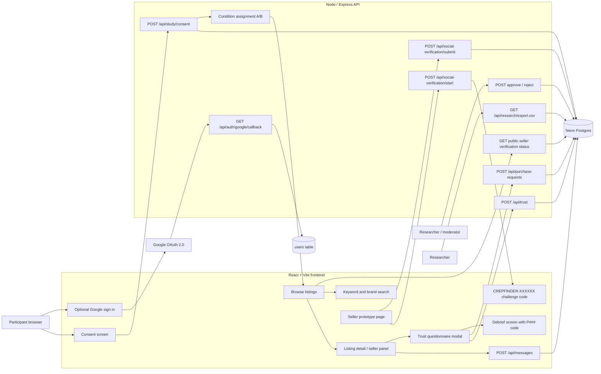

# Architecture Diagram

## Data Captured

The backend stores participant codes, condition assignments, consent timestamps, trust questionnaire responses, selected listing IDs, social verification requests, moderation status, and exportable research data. Product listings and trust cues are controlled prototype materials rather than live marketplace records.

## OAuth Scope

Google OAuth is implemented as an optional sign-in layer. It stores account metadata on the `users` table and demonstrates a real third-party authentication integration, but it does not replace the consent screen and does not prove marketplace trustworthiness. Participant responses remain tied to the generated `P###` participant code.

## Development Methodology Trace

The implementation is documented as a hybrid methodology in `docs/project-management/`. The planning stage is represented by the fixed research flow, condition definitions, and ethical boundaries. The implementation stage is represented by a Kanban-style task board and iteration log that map prototype features to source files and validation checks.

## Social Verification Scope

The prototype implements moderated challenge-code verification as a bounded trust cue. Sellers can link a social profile, receive a unique `CREPFINDER-XXXXXX` challenge code, submit evidence, and receive a `pending`, `submitted`, `verified`, or `rejected` status. Public listing and seller-profile views expose only safe fields: platform, username/profile URL, status, and verification date.

This workflow supports the dissertation claim that CrepFinder implements social verification indicators. It does not prove legal identity, prevent scams, or guarantee product authenticity.
