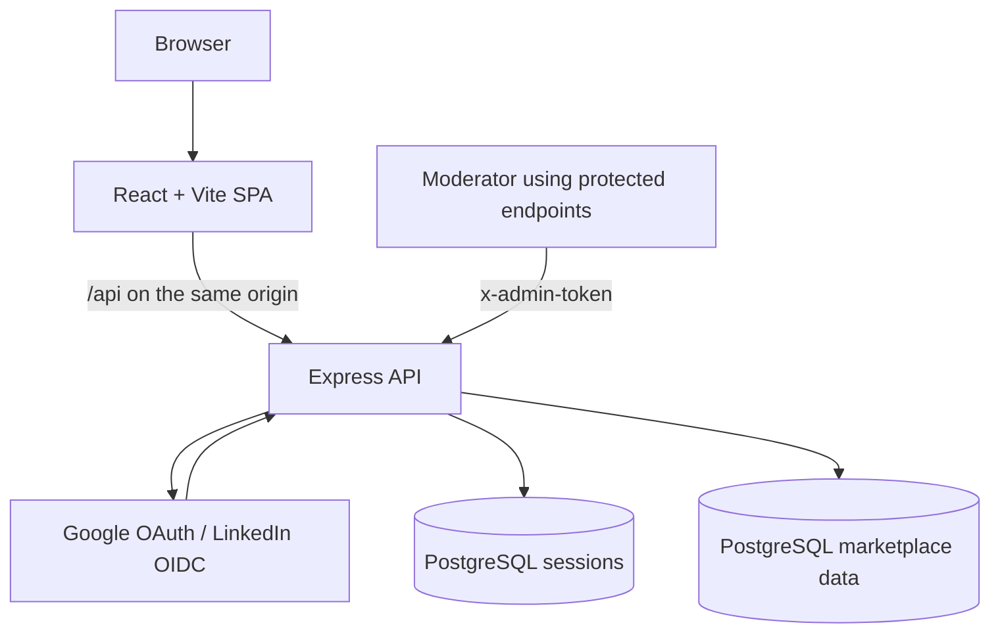
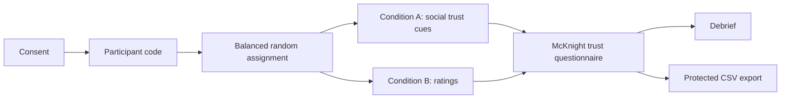

# CrepFinder Architecture

## Product Deployment

```mermaid
flowchart TB
  Browser["Browser"]
  React["React + Vite SPA"]
  Express["Express API"]
  OAuth["Google OAuth / LinkedIn OIDC"]
  Sessions[("PostgreSQL sessions")]
  Marketplace[("PostgreSQL marketplace data")]
  Moderator["Moderator using protected endpoints"]

  Browser --> React
  React -->|"/api on the same origin"| Express
  Express --> OAuth
  OAuth --> Express
  Express --> Sessions
  Express --> Marketplace
  Moderator -->|"x-admin-token"| Express
```

The production Docker image builds the frontend in one stage and installs backend production dependencies in another. The runtime stage serves both from Express as an unprivileged `node` user. Railway runs schema preparation before deployment and waits for `/api/ready` to confirm database connectivity before switching traffic.

Using one origin is deliberate. CrepFinder uses server-side, HTTP-only sessions for OAuth and authenticated marketplace actions. Keeping the UI and API together avoids making third-party cookies a requirement.

## Marketplace Boundaries

- **Authentication:** OAuth provider identity is mapped to the `users` table, then stored in a server-side session.
- **Listings:** only a signed-in seller can create a listing; the seller ID comes from the session.
- **Purchase requests:** production requests require a signed-in buyer and store the account email from PostgreSQL.
- **Order progress:** buyer and seller transitions are allowlisted separately.
- **Reviews:** a review must match the signed-in buyer and a completed purchase request.
- **Seller verification:** the signed-in seller receives a challenge code and submits evidence; approval requires a private moderation token.
- **Research data:** participant-code endpoints are mounted only when research mode is enabled.

## Research Mode

```mermaid
flowchart LR
  Consent["Consent"] --> Code["Participant code"]
  Code --> Assignment["Balanced random assignment"]
  Assignment --> ConditionA["Condition A: social trust cues"]
  Assignment --> ConditionB["Condition B: ratings"]
  ConditionA --> Measure["McKnight trust questionnaire"]
  ConditionB --> Measure
  Measure --> Debrief["Debrief"]
  Measure --> Export["Protected CSV export"]
```

Assignment chooses the condition with fewer observations and uses a random 50/50 tie-break when counts are equal. This is balanced random assignment, not unrestricted simple random assignment.

Research mode is retained for reproducibility but disabled in production by `ENABLE_RESEARCH_ROUTES=false`.

## Trust Claim Boundary

OAuth confirms control of an external account. Social verification confirms completion of CrepFinder's challenge and moderation flow. Transaction-locked reviews confirm that CrepFinder recorded a completed purchase request. None of these signals independently proves legal identity, sneaker authenticity, successful delivery, or seller honesty.
