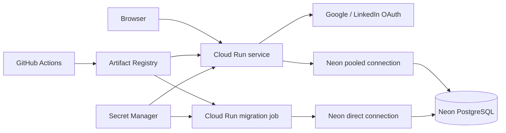

# Google Cloud Run Deployment

CrepFinder deploys as one public Cloud Run service. The compiled React app and
Express API share one HTTPS origin, while a separate Cloud Run job prepares the
Neon schema before each application deployment.

## Production Architecture



The production workflow only runs manually or after the `CI` workflow succeeds
for a push to `main`. GitHub authenticates with Workload Identity Federation, so
the repository never stores a Google service-account key.

## Google Cloud Bootstrap

Use a dedicated Google Cloud project with billing enabled. Replace the example
project ID with a globally unique value.

```bash
export PROJECT_ID="crepfinder-production-CHANGE-ME"
export REGION="europe-west2"
export REPOSITORY="toksadekoya/crepfinder"
export RUNTIME_SERVICE_ACCOUNT="crepfinder-runtime@${PROJECT_ID}.iam.gserviceaccount.com"
export DEPLOYER_SERVICE_ACCOUNT="crepfinder-deployer@${PROJECT_ID}.iam.gserviceaccount.com"

gcloud config set project "${PROJECT_ID}"
gcloud services enable \
  artifactregistry.googleapis.com \
  iam.googleapis.com \
  iamcredentials.googleapis.com \
  run.googleapis.com \
  secretmanager.googleapis.com \
  sts.googleapis.com

gcloud artifacts repositories create crepfinder \
  --repository-format=docker \
  --location="${REGION}" \
  --description="CrepFinder production images"

gcloud iam service-accounts create crepfinder-runtime \
  --display-name="CrepFinder Cloud Run runtime"

gcloud iam service-accounts create crepfinder-deployer \
  --display-name="CrepFinder GitHub deployer"
```

Grant the deployer only the project roles needed to publish images and manage
Cloud Run. Grant the runtime identity access to Secret Manager.

```bash
for role in roles/artifactregistry.writer roles/run.admin; do
  gcloud projects add-iam-policy-binding "${PROJECT_ID}" \
    --member="serviceAccount:${DEPLOYER_SERVICE_ACCOUNT}" \
    --role="${role}"
done

gcloud iam service-accounts add-iam-policy-binding \
  "${RUNTIME_SERVICE_ACCOUNT}" \
  --member="serviceAccount:${DEPLOYER_SERVICE_ACCOUNT}" \
  --role="roles/iam.serviceAccountUser"

gcloud projects add-iam-policy-binding "${PROJECT_ID}" \
  --member="serviceAccount:${RUNTIME_SERVICE_ACCOUNT}" \
  --role="roles/secretmanager.secretAccessor"
```

## Production Secrets

Create four secrets. Enter the two Neon URLs and two independently generated
random values only when prompted. Terminal input is hidden and is not stored in
shell history.

```bash
read -rsp "Pooled Neon URL: " VALUE
printf '%s' "${VALUE}" | gcloud secrets create crepfinder-database-url --data-file=-
unset VALUE
printf '\n'

read -rsp "Direct Neon URL: " VALUE
printf '%s' "${VALUE}" | gcloud secrets create crepfinder-database-direct-url --data-file=-
unset VALUE
printf '\n'

openssl rand -base64 48 | tr -d '\n' |
  gcloud secrets create crepfinder-session-secret --data-file=-

openssl rand -base64 48 | tr -d '\n' |
  gcloud secrets create crepfinder-social-admin-token --data-file=-
```

## Keyless GitHub Authentication

Create a provider restricted to this repository and the `main` branch.

```bash
gcloud iam workload-identity-pools create github \
  --location=global \
  --display-name="GitHub Actions"

gcloud iam workload-identity-pools providers create-oidc crepfinder \
  --location=global \
  --workload-identity-pool=github \
  --display-name="CrepFinder GitHub Actions" \
  --issuer-uri="https://token.actions.githubusercontent.com" \
  --attribute-mapping="google.subject=assertion.sub,attribute.repository=assertion.repository,attribute.ref=assertion.ref" \
  --attribute-condition="assertion.repository=='${REPOSITORY}' && assertion.ref=='refs/heads/main'"

export POOL_NAME="$(
  gcloud iam workload-identity-pools describe github \
    --location=global \
    --format='value(name)'
)"
export PROVIDER_NAME="$(
  gcloud iam workload-identity-pools providers describe crepfinder \
    --location=global \
    --workload-identity-pool=github \
    --format='value(name)'
)"

gcloud iam service-accounts add-iam-policy-binding \
  "${DEPLOYER_SERVICE_ACCOUNT}" \
  --role="roles/iam.workloadIdentityUser" \
  --member="principalSet://iam.googleapis.com/${POOL_NAME}/attribute.repository/${REPOSITORY}"
```

Store the non-secret identifiers as GitHub repository variables:

```bash
gh variable set GCP_PROJECT_ID --body "${PROJECT_ID}"
gh variable set GCP_REGION --body "${REGION}"
gh variable set GCP_WORKLOAD_IDENTITY_PROVIDER --body "${PROVIDER_NAME}"
gh variable set GCP_DEPLOYER_SERVICE_ACCOUNT --body "${DEPLOYER_SERVICE_ACCOUNT}"
gh variable set GCP_RUNTIME_SERVICE_ACCOUNT --body "${RUNTIME_SERVICE_ACCOUNT}"
```

Run **Deploy to Cloud Run** from the GitHub Actions page once. Later pushes to
`main` deploy automatically only after `CI` succeeds.

## OAuth

After the first deployment, use its HTTPS service URL as the authorised origin
and callback base. Store OAuth client secrets in Secret Manager rather than in
GitHub or plain environment variables.

```bash
export SERVICE_URL="$(
  gcloud run services describe crepfinder \
    --region="${REGION}" \
    --format='value(status.url)'
)"

read -rsp "Google OAuth client secret: " VALUE
printf '%s' "${VALUE}" |
  gcloud secrets create crepfinder-google-client-secret --data-file=-
unset VALUE
printf '\n'

gcloud run services update crepfinder \
  --region="${REGION}" \
  --update-env-vars="GOOGLE_CLIENT_ID=YOUR_CLIENT_ID,GOOGLE_OAUTH_REDIRECT_URI=${SERVICE_URL}/api/auth/google/callback" \
  --update-secrets="GOOGLE_CLIENT_SECRET=crepfinder-google-client-secret:latest"
```

Use equivalent variables for LinkedIn:

```text
LINKEDIN_CLIENT_ID
LINKEDIN_CLIENT_SECRET
LINKEDIN_OAUTH_REDIRECT_URI
```

## Verification

Both endpoints must return HTTP `200`, and readiness must include
`"database":"ok"`.

```bash
curl --fail "${SERVICE_URL}/api/health"
curl --fail "${SERVICE_URL}/api/ready"
```

Then complete the browser smoke test in the main README. Cloud Run revisions,
job executions, application logs, and readiness failures are available in Cloud
Logging.
